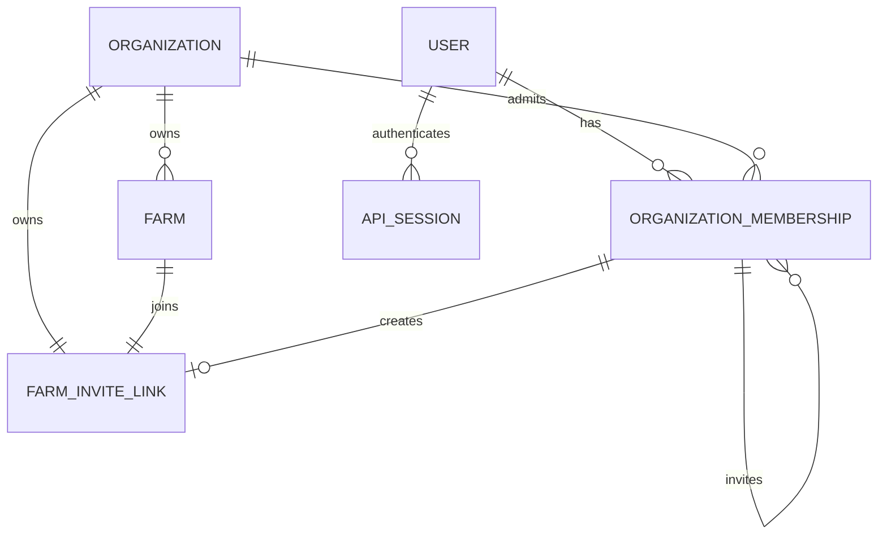
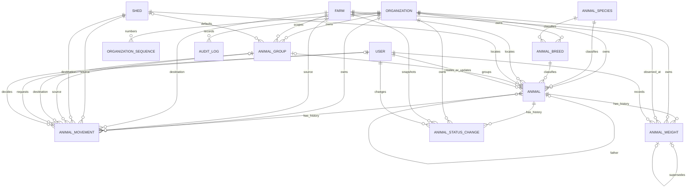
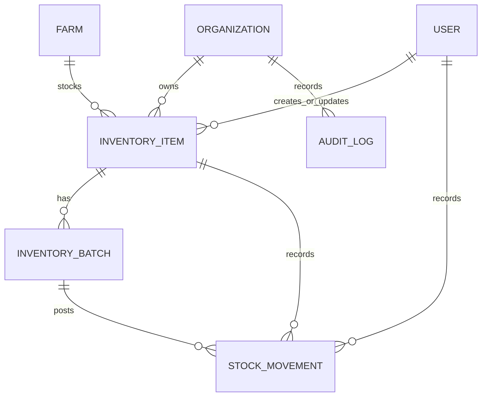
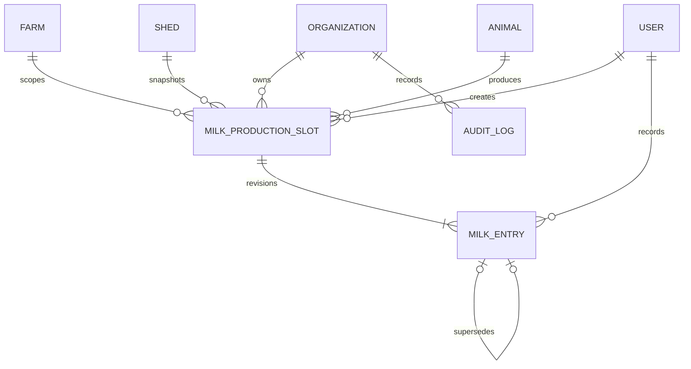
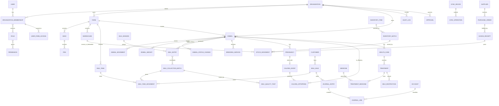

# ERD

## Implemented owner and family account relationships

One `primary_owner` creates and controls the reusable invite. Each accepted
invite creates another user with a persistent `family_admin` membership in the
same organization/farm. Removing access changes membership status and revokes
sessions; it does not delete identity or history.

## Implemented Phase 2A registry, Phase 2B movements, and Phase 2C measurements

Every tenant relationship shown above is constrained or scoped by organization; operational farm links additionally use composite keys so a valid UUID from another tenant/farm cannot be linked. Parent links preserve historical archived rows. An approved movement atomically advances current location. A status command appends history and advances operational status/version atomically. Weight corrections retain and link both rows; latest weight excludes superseded observations.

## Implemented inventory core

Item, batch, and movement rows repeat organization and farm identifiers so
composite foreign keys can reject cross-tenant or cross-farm links. The batch
quantity is a current projection; the append-only movement is the stock-event
history. Creating opening stock or receiving stock changes both atomically.

## Implemented Phase 3A daily milk production

One slot uniquely identifies an animal, production date, and standard milking
session. Corrections append linked entry revisions; quantities on superseded
rows remain unchanged. Repeated organization, farm, shed, and animal scope is
protected by composite foreign keys.

## Product-wide preliminary ERD

This remaining module-level ERD is intentionally preliminary and does not imply that later tables exist.

Cross-cutting attachments, alerts, approvals, and audit entries reference an allowlisted entity type plus UUID. Application services verify same-tenant ownership because ordinary foreign keys cannot enforce a polymorphic target.
