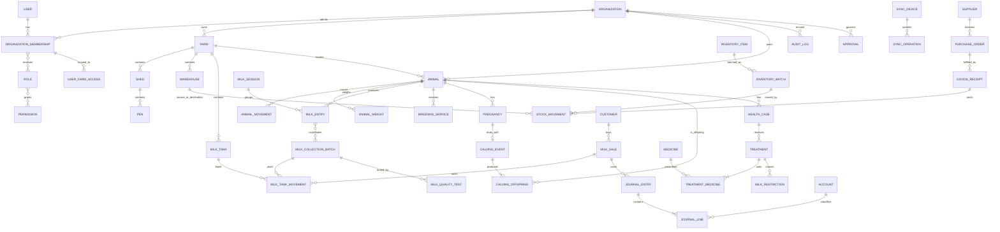

# Preliminary ERD

This is a module-level ERD, intentionally preliminary; it does not represent Phase 0 migrations.

Cross-cutting attachments, alerts, approvals, and audit entries reference an allowlisted entity type plus UUID. Application services verify same-tenant ownership because ordinary foreign keys cannot enforce a polymorphic target.
