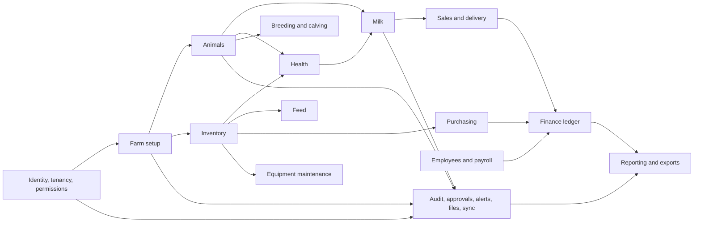

# Module Dependencies

## Dependency direction

## Rules

- Identity/tenancy is foundational, not imported from business modules.
- Modules communicate through application actions and domain events, not direct controller-to-model mutations across modules.
- Inventory owns stock movements. Purchasing, feed, health, sales, and maintenance request postings from it.
- Finance owns journals. Other modules request postings and retain links to the resulting journal, never edit account balances.
- Milk owns sellable/restricted/tank balance. Sales cannot decrement tank totals directly.
- Alerts and reporting consume committed events/projections; they do not own source transactions.
- Sync transports approved commands and changes; it does not duplicate domain validation.

Phase 2A implements the Animal Registry portion of `Animals`: species, breeds, farm groups, identity/profile, initial location, parentage, archive/restore, and read cache. Phase 2B adds online movements as a separate domain beneath Animals. It depends on registry identity/current location, farm setup, tenancy/permissions, audit/idempotency, and sync read caching; it exposes only committed location projection changes back to the registry. Weight, lifecycle, QR, photo, offline-mutation, and timeline dependencies remain future work.

## Implementation ordering

## Phase 2C dependency detail

- `AnimalWeights` depends on the animal registry, tenancy/farm access, settings, idempotency middleware, and audit support. It does not depend on movement UI or later domains.
- `AnimalStatuses` depends on the animal registry's versioned projection, tenancy/farm access, idempotency middleware, and audit support.
- The registry may expose an authorized latest-weight projection but does not mutate weight history.
- Flutter presentation depends on animal measurement repositories/providers; Drift is a read cache, not a second authority.
- Sync reads weight/status changes after server authorization. No Phase 2C mutation depends on or writes the outbox.

## Inventory-core dependency detail

- `Inventory` depends on tenancy, active-farm access, role permissions,
  idempotency, audit, and MySQL transactions; it does not depend on animals,
  health, feed rations, purchasing, or finance.
- Item metadata is separate from batches and permanent stock movements.
  Consumers must request future issue/receipt actions from Inventory and must
  never update its quantity projection directly.
- Flutter presentation depends on the inventory repository/providers. Inventory
  does not yet depend on Drift or the sync outbox.
- Future health, feed, purchasing, sales, and equipment integrations must use
  stable inventory commands rather than importing inventory persistence.

## Phase 3A milk dependency detail

- `MilkProduction` depends on active organization/farm context, adult female
  animal identity/current shed, permission middleware, audit, idempotency, and
  transactional duplicate protection.
- Production slots own animal/date/session uniqueness. Immutable entry
  revisions own measurements and corrections.
- Flutter quick entry depends on the milk repository/provider, Drift schema 5,
  and the existing outbox. The server remains authoritative when queued
  commands synchronize.
- Collection, tank, withdrawal, quality, sales, and finance modules may consume
  committed milk production later; none may rewrite the production history.

## Phase 7A workforce and finance dependency detail

- `Workforce` depends on tenancy, active-farm access, role permissions,
  organization sequencing, idempotency, audit, and MySQL transactions.
- Employee loans and paid payroll request postings through the Finance posting
  service; Workforce never edits journal lines or system-account balances.
- `Finance` owns exact PKR income/expense source records, hidden system
  accounts, immutable journal entries, and balanced journal lines.
- Flutter presentation depends on workforce and finance repositories/providers.
  These sensitive workflows are online-only and do not depend on Drift or the
  sync outbox in Phase 7A.
- Attendance, statutory payroll, purchasing, sales, and inventory valuation are
  not dependencies of the implemented core and require separately approved
  integrations.

Foundation -> animal registry -> online animal movements/measurements -> owner
onboarding -> inventory core -> remaining approved animal capabilities -> milk
-> health/breeding -> inventory expansion/feed -> purchase/sales ->
finance/workforce -> equipment/reports/advanced sync -> hardening. A later
module may depend on stable public contracts from an earlier module, never on
its UI or private persistence details.
