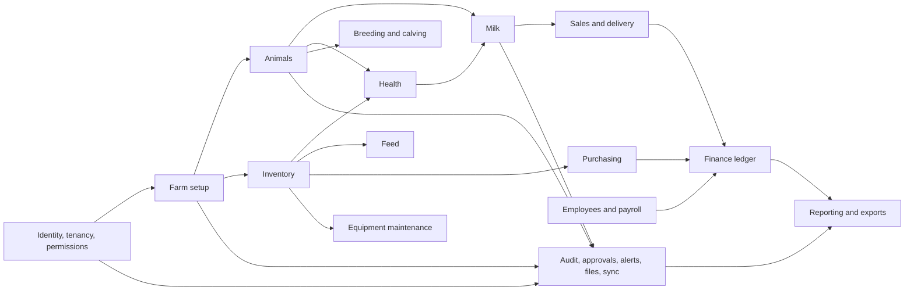

# Module Dependencies

## Dependency direction

## Rules

- Identity/tenancy is foundational, not imported from business modules.
- Modules communicate through application actions and domain events, not direct controller-to-model mutations across modules.
- Inventory owns stock movements. Purchasing, feed, health, sales, and maintenance request postings from it.
- Finance owns journals. Other modules request postings and retain links to the resulting journal, never edit account balances.
- Milk owns sellable/restricted/tank balance. Sales cannot decrement tank totals directly.
- Alerts and reporting consume committed events/projections; they do not own source transactions.
- Sync transports approved commands and changes; it does not duplicate domain validation.

Phase 2A implements the Animal Registry portion of `Animals`: species, breeds, farm groups, identity/profile, initial location, parentage, archive/restore, and read cache. Phase 2B adds online movements as a separate domain beneath Animals. It depends on registry identity/current location, farm setup, tenancy/permissions, audit/idempotency, and sync read caching; it exposes only committed location projection changes back to the registry. Weight, lifecycle, QR, photo, offline-mutation, and timeline dependencies remain future work.

## Implementation ordering

Foundation -> animal registry -> online animal movements -> separately approved offline animal workflows -> remaining approved animal capabilities -> milk -> health/breeding -> inventory/feed -> purchase/sales -> finance/workforce -> equipment/reports/advanced sync -> hardening. A later module may depend on stable public contracts from an earlier module, never on its UI or private persistence details.
